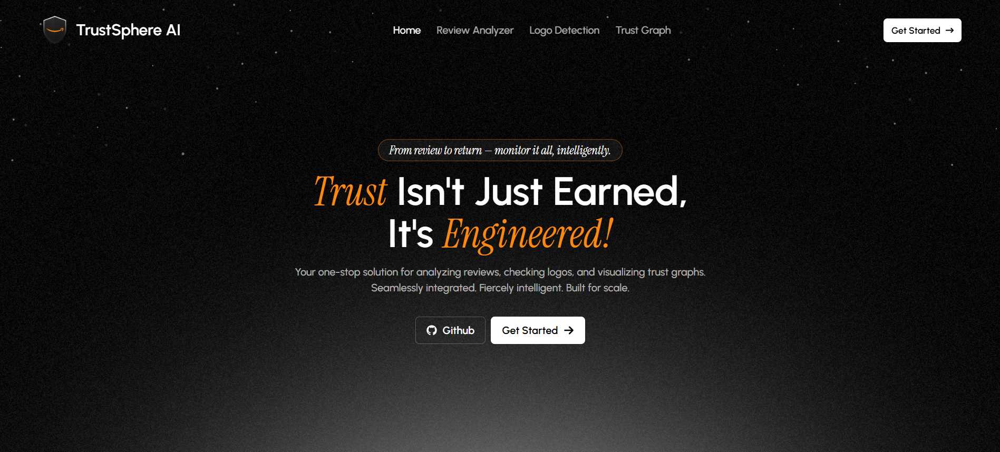
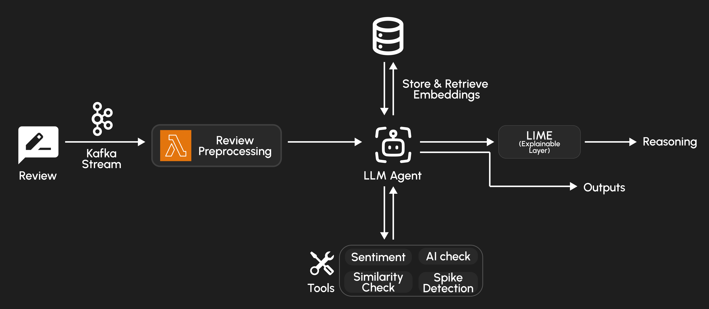
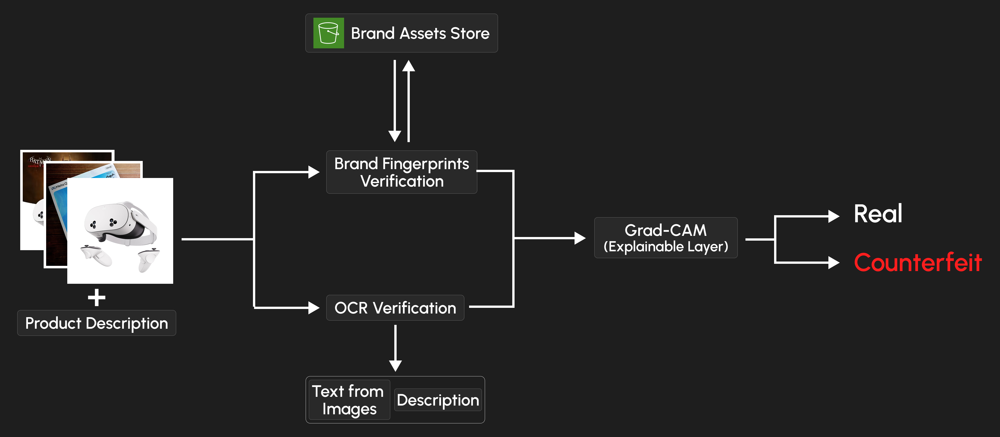
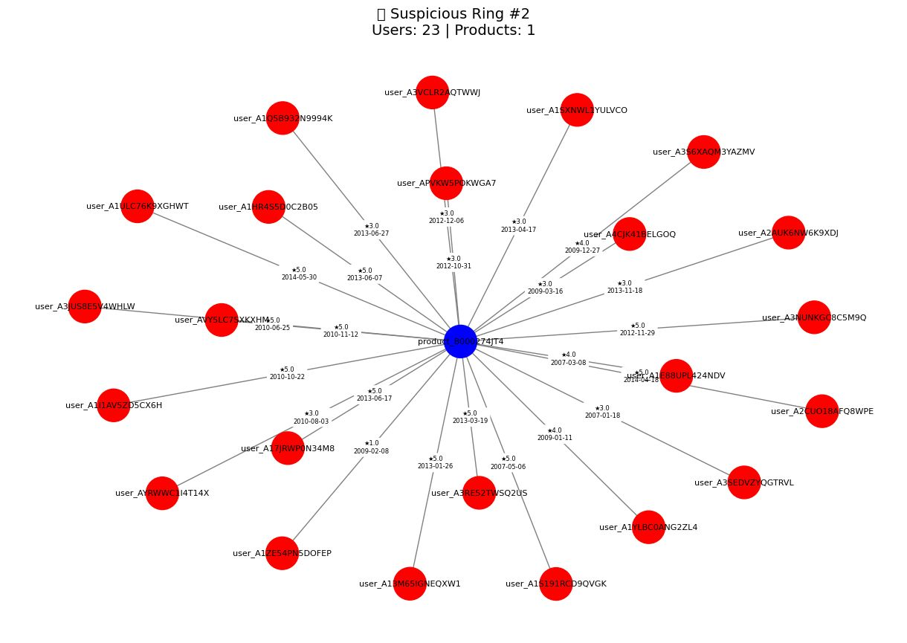
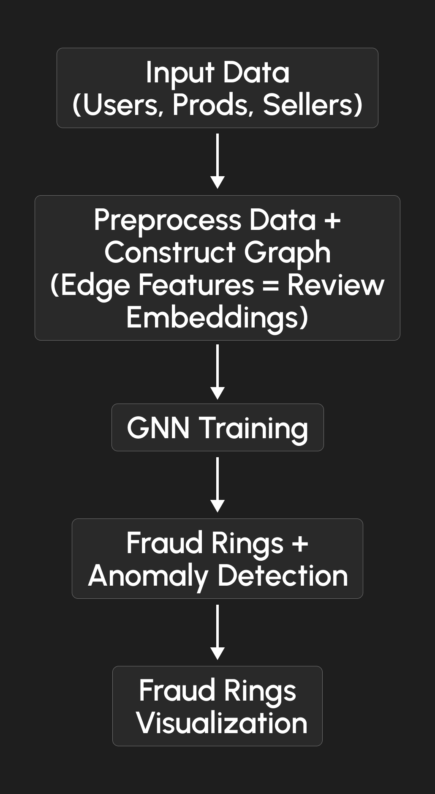
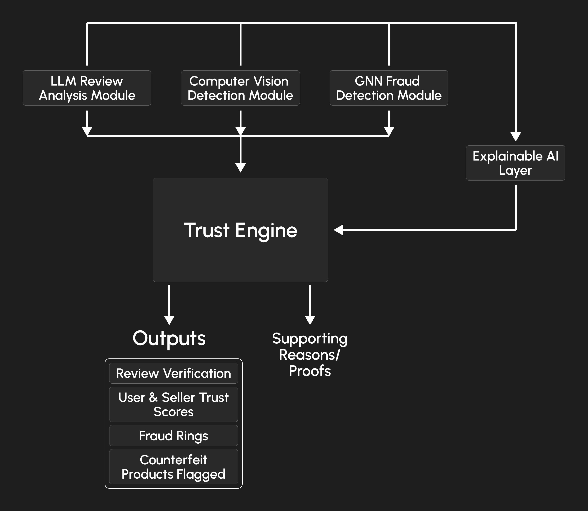
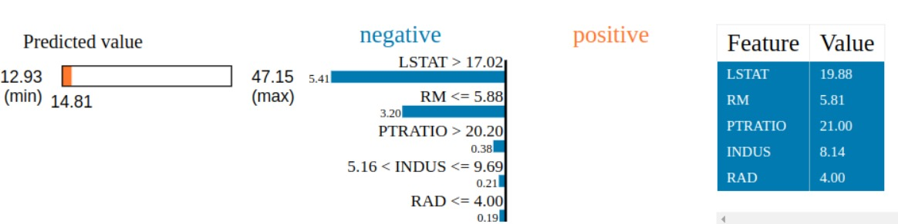
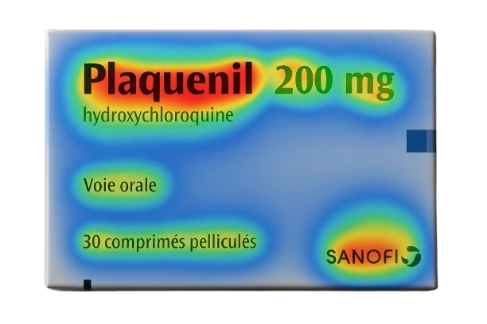
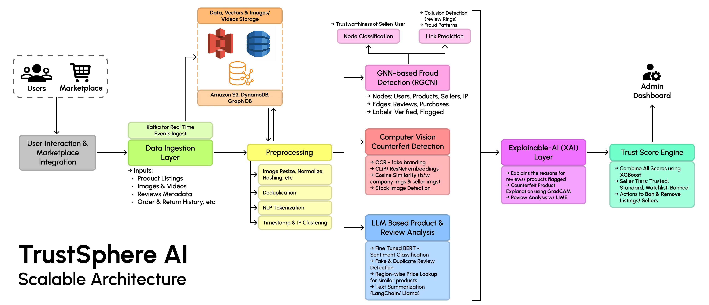

## TrustSphere AI Demo Video
* You will regret missing this demo video! Click on the thumbnail below to watch it now!

[](https://youtu.be/IsfnttIBfAc)

> **Presenting TrustSphere AI:**
> An LLM-powered Trust & Safety platform for detecting review fraud, counterfeit listings, and seller manipulation in e-commerce.



---
## What is TrustSphere AI?

**TrustSphere AI** is an explainable, scalable, and intelligent platform built to combat **fake reviews**, **counterfeit products**, and **fraudulent seller networks** in e-commerce ecosystems.  
We leverage **LLMs**, **Computer Vision**, **Graph Intelligence**, and **Explainable AI** to deliver **real-time trust insights** to platforms, buyers, and compliance teams.

---

## Key Features

### ✅ Review Analysis with LLMs + LangChain
- Analyze sentiment, detect AI-generated content, and flag suspicious reviews
- Uses similarity search (FAISS + embeddings) to detect review spamming
- Tech Stack: `LangChain`, `HuggingFace Transformers`, `FAISS`, `Kafka`, `AWS Lambda`



### 🖼 CV-Based Product Listing Verification
- Identify counterfeit packaging via product image analysis
- Detects reused images, manipulated branding, and fake barcodes
- Siamese networks + Grad-CAM to highlight mismatched or reused assets
- Tech Stack: `HuggingFace ViT`, `Grad-CAM`, `OpenCV`
  



### 🕸 Graph-Based Seller Networks
- Builds seller-buyer-review graphs to detect **review farms** and **fraud rings**
- GNN-powered fraud ring detection across millions of user-product interactions
- IP clustering and suspicious co-reviewing behavior modeling
- Tech Stack: `Neo4j`, `PyTorch Geometric`, `Graph Neural Networks`




### 📊 Trust Score Engine
- Calculates seller-level integrity scores based on:
  - Review quality and quantity
  - Return rates and dispute frequency
  - GNN anomaly signals and image-based inconsistencies
- Powers moderation decisions and visibility rankings
- Tech Stack: `Flask`, `SQLAlchemy`, `Redis`



### 🔍 Explainable AI Layer
- Review decisions are explained using **LIME** for LLM-based flags
- Image-based flags are explained using **Grad-CAM** visualizations

 

---
## Final Architecture Overview


---

## Project Structure

```bash
📦 TrustSphere-AI/
├── server/                 # Flask backend app
│   ├── models/             # ML models, embeddings, CV, GNN
│   ├── services/           # Data processing
│   ├── routes/             # API endpoints
│   ├── index.js            # Main server entry point
│   └── ...
├── client/                 # Frontend React app
│   ├── src/                # React components, pages, styles
│   ├── public/             # Static assets, icons, images
│   ├── package.json        # Frontend dependencies
│   └── ...
├── assets/                # Images, logos, and other static assets
├── README.md              # You're here!
└── requirements.txt
└── package.json
```

---

## Instructions to Run the Project Locally

### 1. Clone the Repo

```bash
git clone https://github.com/HitG010/TrustSphere-AI.git
cd TrustSphere-AI
```

### 2. Set Up Virtual Environment

```bash
python -m venv venv
source venv/bin/activate   # or venv\Scripts\activate on Windows
```
* Or use Conda if preferred:

```bash
conda create -n trustsphere python=3.9
conda activate trustsphere
```

### 3. Install Requirements

```bash
pip install -r requirements.txt
```

### 4. Start FAISS Embedding Indexer

Make sure to run the embedding loader:

```bash
python indexing/index_reviews.py   # Pre-load review.json embeddings
```
### 5. Run the Frontend
```bash
cd frontend
npm install
npm run dev
```
### 6. Start the Node.js Backend Server
```bash
cd backend
npm install
nodemon index.js
```

### 7. Run the Flask API Service

```bash
python3 server/models/app.py
```
or
```bash
python server/models/app.py
```

And then naivgate to `http://localhost:5173` in your browser to access the TrustSphere platform.

---

## ⚖️ Scalability Considerations

* ⚙️ **Vector Search** via FAISS with product-level metadata filtering
* 🌐 **LLM Agents** powered via LangChain; scalable with async chains or FastAPI batching
* ☁️ **Real-time Upgrade Plan** with AWS Kinesis + Lambda pipelines (future)
* 📈 **Horizontally scalable** graph detection models via GNNs trained on GPU clusters
* 🔍 Modular microservice architecture enables independent scaling per feature (review vs. CV vs. graph)

---

## 👥 Team

**TrustSphere AI** was built by a passionate team `FigureOut` during the `Amazon HackOn'25` Hackathon.

* Kartik Bindra (Team Leader)
[LinkedIn](https://www.linkedin.com/in/kartik-bindra/) | [GitHub](https://github.com/kartikbindra)

* Hitesh Gupta
[LinkedIn](https://www.linkedin.com/in/hiteshgupta201105/) | [GitHub](https://github.com/HitG010)

* Piyush Bansal
[LinkedIn](https://www.linkedin.com/in/piyush-bansal-673833298/) | [GitHub](https://github.com/Piyush-Bansal9)

